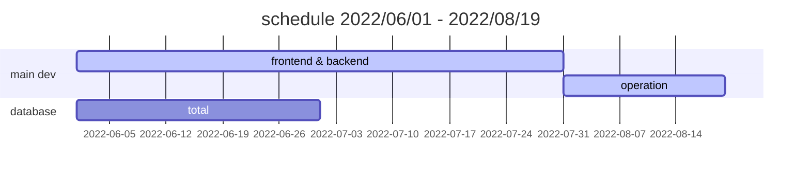
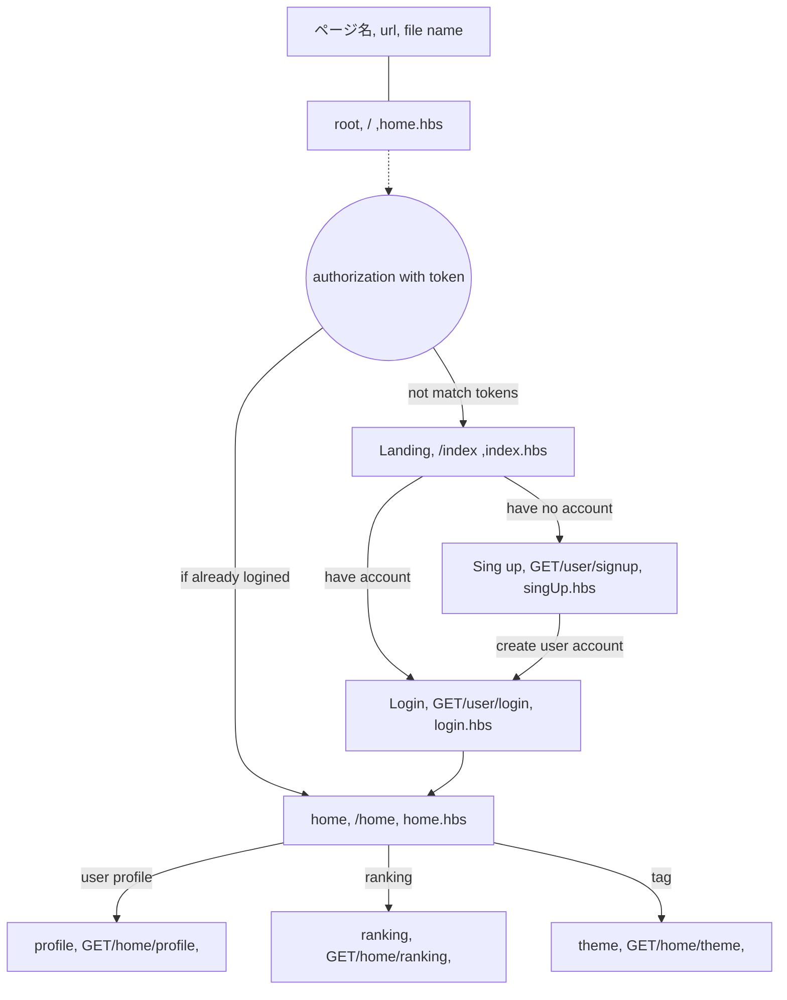
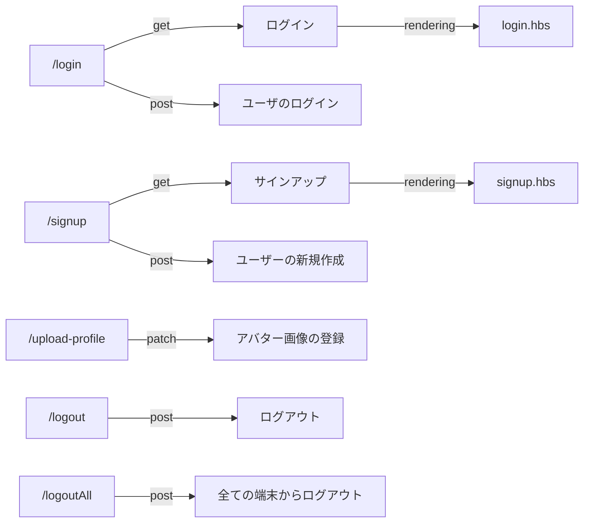
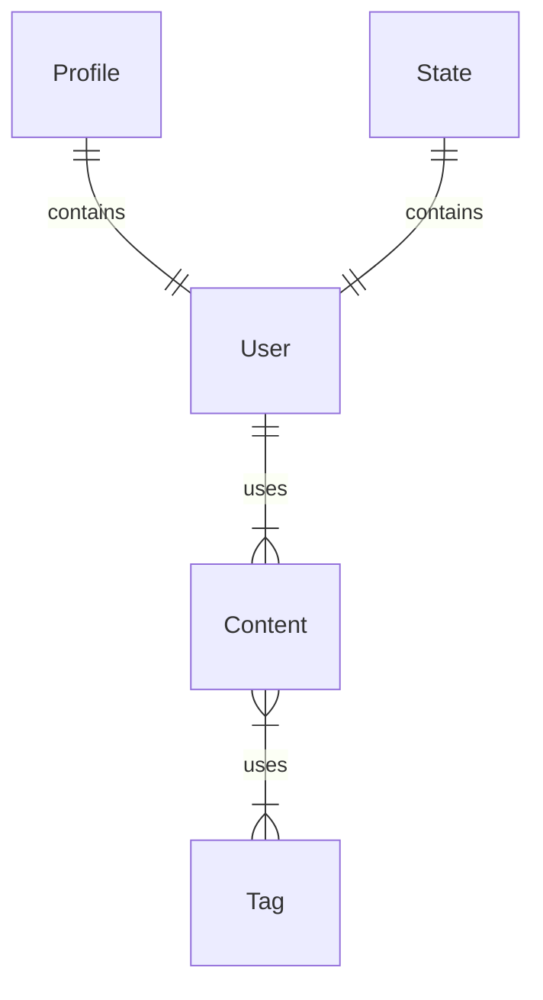

# 俳句や川柳を投稿して交流できる SNSweb アプリケーション　【Node.js / MongoDB / Docker / Cloud Storage / Cloud Run】

## はじめに

---

### 記事の目的

**趣味と勉学目的で作成した Twitter ライクな 575 投稿アプリケーションを解説した記事になります**。

#### 注意点

<u>この Github リポジトリで公開しているソースコードはポートフォリオサイトのソースコードであり、web アプリのものと内容が異なります。 紹介しているアプリケーションは現在も運営中のためソースコード公開することができません、あらかじめご容赦下さい。</u>


主な使用技術はフロントエンドに Vanilla の **JacaScript**、バックエンドに **Node.js**
データベースに **MongoDB**、ストレージに GCP の **Cloud Storage**、デプロイのためのイメージ作成とそのパイプラインに **Docker** と gcloud CLI、デプロイサービスは GCP の**Cloud Run** を使用しています。

## 目次

1. アプリの概要
2. 企画
3. アプリの機能
4. 使用した技術スタック
5. 努力したポイント
6. 難しかった実装
7. 改良が必要な箇所
8. 運営について
9. 実装予定の機能、反省点
10. どのように学習したか

## 開発者について

---

- 12 年間 CG/VFX 業界で映画や TV,CM などの映像の仕事に従事していた
- 趣味で UNREAL ENGINE を使ったゲーム開発を行い、iOS に公開した経験あり
- 独学でプログラミング学習を始めてプログラミングの面白さに気づき転職を考える
- 一児の父 💪
- 趣味はプログラミングで食事と寝る以外はコードを書いているかチュートリアルをみている
- 台湾に住んでいたことがあり中国語が少し話せる

## 1.アプリの概要

---

(1). アプリに登録する
(2). 動画でチェック
(3). 句の投稿
(4). カードの機能
(5). ランキングと話題のタグ

# Paiku

👉 [paiku575.com](https://paiku５７５.com)

**このアプリは俳句や川柳、575 を投稿し、いいねや返信をすることで他のユーザーと交流できる SNS Web アプリケーションです。**
twitter からインスパイアを受けたアプリになるので多くの機能の面で参考にしています

### (1). アプリに登録する

1.  **Sign Up(新規登録)** ボタンからログイン画面に飛んでフォームに必要な情報を入力します


2. 登録が終わると登録したメールアドレス宛に有効化のメールが届くのボタンをクリックします
   

3. 自動的にサイトに飛びログインして手続き完了となります 👏👏👏👏👏🎉

- 現状まだスマホへのレスポンシブは未対応（今後作業予定）ですので PC のブラウザから閲覧していただけると幸いです
- Google Chrome 推奨ですが Safari でもほとんど問題なく見れるはずです

### (2). <u>動画でチェック!🖥</u>

**youtube** に簡単に全体を紹介した動画をアップしていますのでそちらを閲覧して頂けるとよりわかりやすいかと思います
動画は 4 分程度の内容になります

**【Youtube】575 アプリケーション - アプリの解説**
👉 https://www.youtube.com/watch?v=I-VUspfA1WA

### (3). 句の投稿

- 575 を投稿する際**上、中、下句**それぞれ**最大 10 文字**まで記入することができ、**読点またはコンマ**を打つことで <u>句を自動で分割することができます</u>
- 句の最後に半角スペースを追加して#を打てば**タグ**を記入できます
- 画像も投稿することができますがサイズ変更や位置調整は実装していません


### (4). カードの機能

- カードの下部にはオプションがあり左からそれぞれ
  - ❤︎ お気に入り登録
  - ↑ **投票する**
  - コメント 返信
  - ⭐️ **マイセレクトに登録（自分の代表句に登録する）**
  - 三 その他（削除と Twitter への共有）


### (5). 投票とマイセレクトボタンについて

**投票**と**マイセレクト**とは何か？

- 投票はお気に入りと違い、1 日に 10 回好きな句カードに投票できる機能です
  - 現在の実装ではランキングの順位に影響を及ぼします
  - 投票が多いほどカードの見た目が変わる実装を入れようと検討中です
- マイセレクトはフォローユーザーのページで表示される自分の名刺カードに載る一句です
  - 自己紹介もありますが、自己紹介とは別に自分の一句を選択することができる機能です


### (6). ランキングとタグ検索

**ランキング**のページや、**タグ**の一覧を表示するページがありそこから話題の句などを見つけることができるようになっています
ランキングもタグ検索も期間ごと（**1 日、週間、月間、年間、総合**）に分けて表示されるようになっています


## 2. 企画

---

(1). きっかけ
(2). コンセプト
(3). 初期段階での構想
(4). カラー
(5). デザイン案

### (1). きっかけ

MBS テレビで放映されている[プレバト](https://www.mbs.jp/p-battle/)が好きでよく見ているのですが、この TV 番組は 2012 年から放送されているかなりの長寿番組ということを知って、そんなに日本人は俳句が好きだったら俳句のアプリで何かおもしろいものを作りたいなと考えたのがきっかけです

### (2). コンセプト　

- 俳句を作って投稿し交流できる SNS
- 子どもから老人まで楽しめるサイトにしたい

### (3). 初期段階での構想

- 句を投稿できる、または句のような短い文章
- アバターや画像も投稿できる
- 他のユーザーをフォローできる
- 句にコメントを付けることができる

機能面では色々な部分で**Twitter**を参考にさせていただきました。

主な機能は参考にするアプリがあるので早々とデザインへと進めていきます

基本的に作業は<u>**機能の実装とデザインを並行して進めていきました**</u>
その理由は、過去のゲーム制作でも経験したことで、**画作りとアプリの動作がリンクしないまま作業を進めていくとモチベーションに影響が出てくるから**です
個人制作ではモチベーションの維持が非常に大事になってくるので継続しやすい方法をとって進めます

### (4). カラー

**カラースキーマ**は google の**Material UI**を参考にして決め、 配色が決まったら web ページのデザイン作業に入っていきました。
個人的に**グリーン**を使った色が好きなのでグリーンをベースにしています。

- **落ち着いた色合い** -> 色数を抑え、彩度は低め、 **目が疲れないように**

#### ベースカラー

<u>**初期段階の選定なので実際のものとは多少異なります**</u>


### (5). 初期デザイン案

#### デザインツールは**Adobe XD**を使用しています

一番時間がかかったところは句をどのように表示するかという部分で、最終的にはカード上に句を載せて表示するという形になりました
  


## 3. アプリの開発

---

(1). 主な実装内容
(2). 作業の進め方
(3). スケジュール
(4). ページ遷移図
(5). データベース設計

### (1). 主な実装内容

- 句の投稿
- 画像の投稿
- タグの挿入と検索
- 最新カード句の表示
- ユーザー検索
- プロフィールの更新
- アバター画像の投稿
- お気に入り登録
- ユーザーフォロー
- 投票
- 投票回数のリセット
- 返信
- カードの削除と共有
- アカウント情報の更新と削除
- ランキング機能
- タグ一覧表示
- DB スキーマ設定
- メール認証
- 外部クラウドストレージに画像を保存
- パスワードの hash 化
- パスワード忘れた際の対応、メール自動送信
- JWT トークンによる自動ログイン
- 問い合わせ内容をを Discord に転送
- メンテナンスページ
- テスト、ユーザーの作成と句の投稿自動化
- レスポンシブ対応

### (2). 作業の進め方

**仕様書や TODO リストなどは作業時にすぐに確認できるように vs code 内でチェックができるマークダウン + mermaid を使用しています**

今は TODO 系などのタスク管理サービスは沢山ありますが、個人制作で作業時以外はドキュメントを確認しないため、今回はシンプルでアクセスが速いツールを選択しました

#### TODO リスト例

# TODO list

---

# Operation

- [x] カードの共有 URL の修正
- [x] ドメインの修正

# Progress

- [ ] アカウント確認で時間制限を追加
- [x] no-name の時カードに displya name が表示されない
- [ ] プロフィールで場所の追加
- [x] ~~アカウント確認で回数制限を追加~~
- [x] パスワードを忘れた手続きで、パスワードを変更する部分を作る
- [ ] スマートフォン向けのレスポンシブデザインを作る
- [ ] 説明ページを作る
- [ ] client 側 profile スクリプトはもう少し分割できるはず

### 3. スケジュール

- アプリケーションのメイン機能の開発に２ヶ月程度
- デバッグを含めて全ての作業を同時並行で進めていたため細かいことは記録していません...
- デプロイ後も機能の追加やデバッグをおこなっているので開発は現在も続けています



企画を決めた際のスケジュールは大体 1-2 ヶ月、長くても 2 ヶ月で終わらせられるとよいなと考えておりましたが、考えが甘く、当初よりも多数の機能を追加してしまった為予定をオーバーしてしまいました

実際の業務では要件定義を行い予め必要な機能を洗い出し、リスト化してエンジニアに割り当てると考えますが、実装に関しては未知の部分が多く手探りで開発してい故スケジュールを正確に割り出すことができませんでした。反省点は今後に活かしたいと考えます

### 4. ページ遷移図

####　全体像



#### ページ遷移一部 例

## user Router('/user')

**新規登録、ログイン、ログアウト、Email,パスワード変更、アカウント削除などのユーザーの基本部分**



### 5. データベースの設計

**これまで規模の大きな web サービスを作ったことがないため手探りでスクラップ&ビルドを繰り返しながら今の形に落ち着きました**

### ① 使用した DB

#### Mongo DB Atlas

- ドキュメント型の NoSQL DB で Node.js との組み合わせでよく使われるためこちらを使用
- web hosting サービスである Atlas は 500MB の無料枠があり小規模から始めやすい
- Node.js 用の Mongoose という OR ラッパーライブラリが用意されている

### ② 概念図

**シンプルな 3 つのコアモデル＋ 2 で構成されています**



| コレクション名 | 内容                                                                         |
| -------------- | ---------------------------------------------------------------------------- |
| **User**       | ユーザのアカウント情報                                                       |
| **Profile**    | ユーザーのプロフィール情報                                                   |
| **Content**    | 句カード情報　　　　　　　                                                   |
| Tag            | Content のタグの内容を保存する　　　　　　　                                 |
| State          | アカウントの状態を保持する　例：新規登録中、パスワード再設定中　　　　　　　 |

### ③ スキーマのコード：Content (一部)

```javascript
const contentsSchema = new mongoose.Schema(
  {
    description: {
      type: String,
      trim: true,
      required: true,
    },
    image: {
      type: String,
      trim: true,
    },
    comments: [
      {
        type: mongoose.Schema.Types.ObjectId,
        ref: 'Contents',
      },
    ],
    owner: {
      type: mongoose.Schema.Types.ObjectId,
      required: true,
      ref: 'User',
    },
    fans: [
      {
        user: {
          type: mongoose.Schema.Types.ObjectId,
          ref: 'User',
        },
        date: {
          type: Date,
          default: () => new Date(),
        },
      },
    ],
    tags: [String],
  },
  { timestamps: true }
)
```

## 4. 使用した技術スタック

---

### フロントエンド

| 名前                | 種類           | 使用箇所                   | 内容                               |
| ------------------- | -------------- | -------------------------- | ---------------------------------- |
| JavaScript(Vanilla) | 言語           | クライアント側の js は全て | form バリデーションや fetch API 等 |
| HTML/CSS            | 言語(?)        | Web ページ制作             | デザインやレスポンシブ対応         |
| moment.js           | cdn モジュール | クライアント側の js        | 日時の変換、表示                   |
| cookieConsent.js    | cdn モジュール | クライアント側の js        | Cookie の同意                      |

### バックエンド

| 名前                  | 種類                | 使用箇所           | 内容                               |
| --------------------- | ------------------- | ------------------ | ---------------------------------- |
| Node.js               | JavaScript 開発環境 | サーバーサイド     | CRUD 操作、認証、テスト、DB 接続等 |
| express               | npm ライブラリ      | Node.js            | web フレームワーク                 |
| hbs                   | npm ライブラリ      | レンダリングページ | テンプレートエンジン               |
| mongoose              | npm ライブラリ      | Node.js            | mongoDB object modeling            |
| jsonwebtoken          | npm ライブラリ      | Node.js            | トークン生成                       |
| bcryptjs              | npm ライブラリ      | Node.js            | パスワードの hash 化               |
| @google-cloud/storage | npm ライブラリ      | Node.js            | cloud storage との接続             |
| @sendgrid/mail        | npm ライブラリ      | Node.js            | メール送信サービス                 |

### インフラ

| 名前               | 種類          | 使用箇所         | 内容                            |
| ------------------ | ------------- | ---------------- | ------------------------------- |
| Docker             | 開発環境      | アプリのビルド時 | デプロイする前に image へビルド |
| GCP/ Cloud Storage | cloud storage | サーバーサイド   | 画像の保管先                    |
| GCP/ Cloud Run     | サーバーレス  | デプロイ         | コンテナアプリのデプロイ        |

### その他

| 名前        | 種類           | 使用箇所    | 内容               |
| ----------- | -------------- | ----------- | ------------------ |
| git/ github | バージョン管理 | ローカル PC | 作業ファイルの管理 |

## 5. システム構成図


## 6. 使用したスキルとツール

**今回のプロジェクト以外でも使用経験のあるスキルとツールが含まれています**


### Skills

JavaScript/ TypeScript / Python / Node.js / Express / Flask / HTML-CSS / MongoDB / MySQL / Git / Webpack / Docker / GCP-Cloud Storage / GCP-Cloud Run /

### Tools

vs code / postman / adobe XD / Ai
