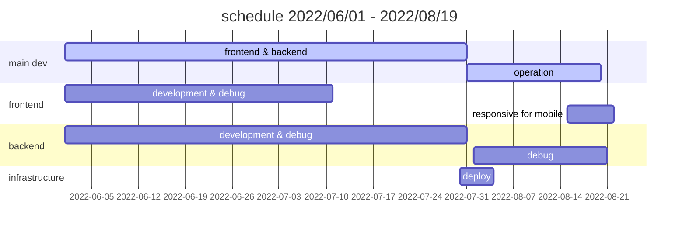
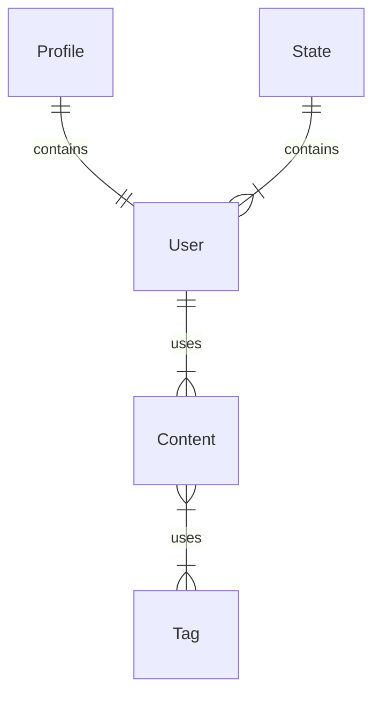
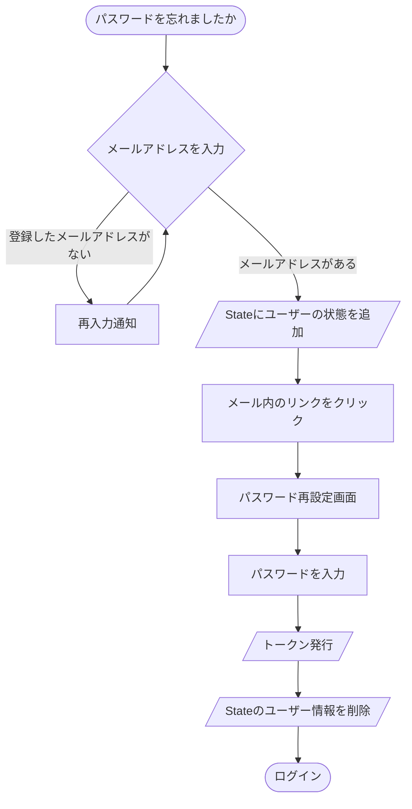
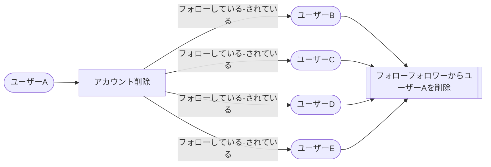
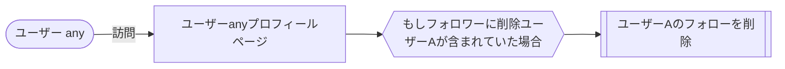

# 俳句や川柳を投稿して交流できる SNS Web アプリケーション　【Node.js / MongoDB / Docker / Cloud Storage / Cloud Run】

## はじめに

---

### 記事の目的

**趣味と勉学目的で作成した Twitter ライクな 575 投稿アプリケーションを解説した記事になります**。

#### New!

新しい Web アプリケーション Next.js, Node/TypeScript で作成したレシピ作成アプリを公開しました！

👉[印刷でいるレシピサイト Good Food](https://good-food-one.vercel.app/)

こちらの　記事の内容は現在のスキルや考え方と比べて古いものとなるため先に上記のポートフォリオをご覧いただけますと幸いです。

#### 注意点

<u>この記事の内容はアプリケーション作成当時(2022 年 08 月時点)の考えをまとめた内容であり、今から見ると間違いのある内容が含まれている部分もございますが当時の思考を反映しそのまま記述しております。その点ご了承いただきますようお願いします</u>

---

### 俳句を投稿して交流できる SNS アプリケーション 【Paiku575】


主な使用技術はフロントエンドに Vanilla の **JacaScript**、バックエンドに **Node.js**
データベースに **MongoDB**、ストレージに GCP の **Cloud Storage**、デプロイのためのイメージ作成とそのパイプラインに **Docker** と gcloud CLI、デプロイサービスは GCP の**Cloud Run** を使用しています。

## 目次

1. アプリの概要
2. 企画
3. アプリの機能
4. 使用した技術スタック
5. システム構成図
6. 使用ツール
7. 頑張った点、難しかった実装
8. 実装予定の機能
9. どのように学習したか
10. 今後の学習
11. 最後に
12. 振り返ってみて

## 開発者について

---

- 12 年間 CG/VFX 業界で映画や TV,CM などの映像の仕事に従事していた
- 趣味で UNREAL ENGINE を使ったゲーム開発を行い、iOS に公開した経験あり
- 独学でプログラミング学習を始めてプログラミングの面白さに目覚め転職を考える
- 一児の父 💪
- 趣味はプログラミングで食事と寝る以外はコードを書いているかチュートリアルを見ている
- 台湾に住んでいたことがあり中国語が少し話せる

## 1.アプリの概要

---

(1). アプリに登録する
(2). 動画でチェック
(3). 句の投稿
(4). カードの機能
(5). ランキングと話題のタグ

# Paiku

👉 [paiku575.com](https://paiku５７５.com)

**このアプリは俳句や川柳、575 を投稿し、いいねや返信をすることで他のユーザーと交流できる SNS Web アプリケーションです。**
twitter からインスパイアを受けたアプリになるので多くの機能の面で参考にしています

### (1). アプリに登録する

1.  **Sign Up(新規登録)** ボタンからログイン画面に飛んでフォームに必要な情報を入力します


2. 登録が終わると登録したメールアドレス宛に有効化のメールが届くのボタンをクリックします
   

3. 自動的にサイトに飛びログインして手続き完了となります 👏👏👏👏👏🎉

- ~~現状まだスマホへのレスポンシブは未対応（今後作業予定）ですので PC のブラウザから閲覧していただけると幸いです~~
- スマホのレスポンシブに対応いたしました
- Google Chrome 推奨ですが Safari でもほとんど問題なく見れるはずです

### (2). <u>動画でチェック!🖥</u>

**youtube** に簡単に全体を紹介した動画をアップしていますのでそちらを閲覧して頂けるとよりわかりやすいかと思います
動画は 4 分程度の内容になります

**【Youtube】575 アプリケーション - アプリの解説**
👉 https://www.youtube.com/watch?v=I-VUspfA1WA

[](https://www.youtube.com/watch?v=I-VUspfA1WA)

### (3). 句の投稿

- 575 を投稿する際**上、中、下句**それぞれ**最大 10 文字**まで記入することができ、**読点またはコンマ**を打つことで <u>句を自動で分割することができます</u>
- 句の最後に半角スペースを追加して#を打てば**タグ**を記入できます
- 画像も一緒に投稿することができます


### (4). カードの機能

- カードの下部にはオプションがあり左からそれぞれ
  - ❤︎ お気に入り登録
  - ↑ **投票する**
  - コメント 返信
  - ⭐️ **マイセレクトに登録（自分の代表句に登録する）**
  - 三 その他（削除と Twitter への共有）


### (5). 投票とマイセレクトボタンについて

**投票、マイセレクト**とは何か？

- **投票**はお気に入りと違い、1 日に 10 回好きな句カードに投票できる機能です
  - 現在の実装ではランキングの順位に影響を及ぼします
  - 投票が多いほどカードの見た目が変わる実装を入れようと検討中です
- **マイセレクト**はフォローユーザーのページで表示される、自分の名刺カードに載る一句です
  - 自己紹介文もありますが、自己紹介とは別に自分の一句を選択することができる機能です


### (6). ランキングとタグ検索

**ランキング**のページや、**タグ**の一覧を表示するページがありそこから話題の句などを見つけることができるようになっています
ランキングもタグ検索も期間ごと（**1 日、週間、月間、年間、総合**）に分けて表示されるようになっています


## 2. 企画

---

(1). きっかけ
(2). コンセプト
(3). 初期段階での構想
(4). カラー
(5). デザイン案

### (1). きっかけ

MBS テレビで放映されている[プレバト](https://www.mbs.jp/p-battle/)が好きでよく見ており、俳句のアプリで何かおもしろいものを作りたいなと考えたのがきっかけです

### (2). コンセプト　

- 俳句を作って投稿し交流できる SNS
- 子どもから老人まで楽しめるサイトにしたい

### (3). 初期段階での構想

- 句を投稿できる、または句のような短い文章
- アバターや画像も投稿できる
- 他のユーザーをフォローできる
- 句にコメントを付けることができる

機能面では色々な部分で**Twitter**を参考にさせていただきました。

主な機能は参考にするアプリがあるので早々とデザインへと進めていきます

基本的に作業は<u>**機能の実装とデザインを並行して進めていきました**</u>
その理由は、過去のゲーム制作でも経験したことで、**画作りとアプリの動作がリンクしないまま作業を進めていくとモチベーションに影響が出てくるから**です
個人制作ではモチベーションの維持が非常に大事になってくるので継続しやすい方法をとって進めていきました

### (4). カラー

**カラースキーマ**は google の**Material UI**を参考にして決め、 配色が決まった後 web ページのデザイン作業に入っていきました。
個人的に**グリーン**を使った色が好きなのでグリーンをベースにしています。

**ポイント**

- **落ち着いた色合い、目に優しい** -> 色数を抑え、彩度は低め、

#### ベースカラー

<u>**初期段階の選定なので実際のものとは多少異なります**</u>


### (5). 初期デザイン案

#### デザインツールは**Adobe XD**を使用しています

句をどのように表示するかという部分で一番時間を要し、最終的にはカード上に句を載せて表示するという形になりました
  


## 3. アプリの開発

---

(1). 主な実装内容
(2). 作業の進め方
(3). スケジュール
(4). ページ遷移図
(5). データベース設計

### (1). 主な実装内容

- 句の投稿
- 画像の投稿
- タグの挿入と検索
- 最新カード句の表示
- ユーザー検索
- プロフィールの更新
- アバター画像の投稿
- お気に入り登録
- ユーザーフォロー
- 投票
- 投票回数のリセット
- 返信
- カードの削除と共有
- アカウント情報の更新と削除
- ランキング機能
- タグ一覧表示
- DB スキーマ設定
- メール認証
- 外部クラウドストレージに画像を保存
- パスワードの hash 化
- パスワード忘れた際の対応、メール自動送信
- JWT トークンによる自動ログイン
- 問い合わせ内容をを Discord に転送
- メンテナンスページ
- テスト、ユーザーの作成と句の投稿自動化
- レスポンシブ対応

### (2). 作業の進め方

**仕様書や TODO リストなどは作業時にすぐに確認できるように vs code 内でチェックができるマークダウン + mermaid を使用しています**

今は TODO 系などのタスク管理サービスは沢山ありますが、個人制作で作業時以外はドキュメントを確認しないため、今回はシンプルでアクセスが速いツールを選択しました

### TODO リスト例

### TODO list

---

#### Operation

- [x] カードの共有 URL の修正
- [x] ドメインの修正

#### Progress

- [ ] アカウント確認で時間制限を追加
- [x] no-name の時カードに displya name が表示されない
- [ ] プロフィールで場所の追加
- [x] ~~アカウント確認で回数制限を追加~~
- [x] パスワードを忘れた手続きで、パスワードを変更する部分を作る
- [ ] スマートフォン向けのレスポンシブデザインを作る
- [ ] 説明ページを作る
- [ ] client 側 profile スクリプトはもう少し分割できるはず

### (3). スケジュール

- アプリケーションのメイン機能の開発に２ヶ月程度
- デバッグを含めて全ての作業を同時並行で進めていたため以下のスケジュールはあくまで目安です
- デプロイ後も機能の追加やデバッグをおこなっているので開発は現在も続けています(~2022/08 末まで)



企画を決めた際のスケジュールは大体 1-2 ヶ月、長くても 2 ヶ月で終わらせられるとよいなと考えておりましたが、考えが甘く、当初よりも多数の機能を追加してしまった為予定をオーバーしてしまいました

実際の業務では要件定義を行い予め必要な機能を洗い出し、リスト化してエンジニアに割り当てると考えますが、実装に関しては未知の部分が多く手探りで開発していたゆえ、スケジュールを正確に割り出すことができませんでした。反省点は今後に活かしたいと考えます

### 4. ページ遷移図

### 全体像


#### ページ遷移一部 例

## user Router('/user')

**新規登録、ログイン、ログアウト、Email,パスワード変更、アカウント削除などのユーザーの基本部分**


### 5. データベース設計

**これまで規模の大きな web サービスを作ったことがないため手探りでスクラップ&ビルドを繰り返しながら今の形に落ち着きました**

### ① 使用した DB

#### Mongo DB Atlas

- ドキュメント型の NoSQL DB で Node.js との組み合わせでよく使われるためこちらを使用（mongodb のクエリは javascript で記述されているため相性が良いと思いました）
- web hosting サービスである Atlas は 500MB の無料枠があり小規模から始めやすい
- Node.js 用の Mongoose という ORM ライブラリが用意されている

### ② 概念図

**3 つのコアモデル＋ 2 で構成されています**



| コレクション名 | 内容                                                                         |
| -------------- | ---------------------------------------------------------------------------- |
| **User**       | ユーザのアカウント情報                                                       |
| **Profile**    | ユーザーのプロフィール情報                                                   |
| **Content**    | 句カード情報　　　　　　　                                                   |
| Tag            | Content のタグの内容を保存する　　　　　　　                                 |
| State          | アカウントの状態を保持する　例：新規登録中、パスワード再設定中　　　　　　　 |

### ③ スキーマ：サンプル

Content モデルのスキーマは以下のように作成しています
コードは少し長いので一部省略しています

```javascript
const contentsSchema = new mongoose.Schema(
  {
    description: {
      type: String,
      trim: true,
      required: true,
    },
    image: {
      type: String,
      trim: true,
    },
    comments: [
      {
        type: mongoose.Schema.Types.ObjectId,
        ref: 'Contents',
      },
    ],
    owner: {
      type: mongoose.Schema.Types.ObjectId,
      required: true,
      ref: 'User',
    },
    fans: [
      {
        user: {
          type: mongoose.Schema.Types.ObjectId,
          ref: 'User',
        },
        date: {
          type: Date,
          default: () => new Date(),
        },
      },
    ],
    tags: [String],
  },
  { timestamps: true }
)
```

## 4. 使用した技術スタック

---

### フロントエンド

| 名前                | 種類           | 使用箇所                   | 内容                               |
| ------------------- | -------------- | -------------------------- | ---------------------------------- |
| JavaScript(Vanilla) | 言語           | クライアント側の js は全て | form バリデーションや fetch API 等 |
| HTML/CSS            | 言語           | Web ページ制作             | デザインやレスポンシブ対応         |
| moment.js           | cdn モジュール | クライアント側の js        | 日時の変換、表示                   |
| cookieConsent.js    | cdn モジュール | クライアント側の js        | Cookie の同意                      |

### バックエンド

| 名前                  | 種類                | 使用箇所           | 内容                               |
| --------------------- | ------------------- | ------------------ | ---------------------------------- |
| Node.js               | JavaScript 開発環境 | サーバーサイド     | CRUD 操作、認証、テスト、DB 接続等 |
| express               | npm ライブラリ      | Node.js            | web フレームワーク                 |
| hbs(handlebars)       | npm ライブラリ      | レンダリングページ | テンプレートエンジン               |
| mongoose              | npm ライブラリ      | Node.js            | mongoDB object modeling            |
| jsonwebtoken          | npm ライブラリ      | Node.js            | JWT トークン生成                   |
| bcryptjs              | npm ライブラリ      | Node.js            | パスワードの hash 化               |
| @google-cloud/storage | npm ライブラリ      | Node.js            | cloud storage との接続             |
| @sendgrid/mail        | npm ライブラリ      | Node.js            | メール送信サービス                 |

### インフラ

| 名前               | 種類          | 使用箇所         | 内容                            |
| ------------------ | ------------- | ---------------- | ------------------------------- |
| Docker             | 開発環境      | アプリのビルド時 | デプロイする前に image へビルド |
| GCP/ Cloud Storage | cloud storage | サーバーサイド   | 画像の保管先                    |
| GCP/ Cloud Run     | サーバーレス  | デプロイ         | コンテナアプリのデプロイ        |

### その他

| 名前        | 種類           | 使用箇所        | 内容               |
| ----------- | -------------- | --------------- | ------------------ |
| git/ github | バージョン管理 | ローカル PC/web | 作業ファイルの管理 |

## 5. システム構成図

---

ローカルの開発環境からデプロイまでのシステム構成図


## 6. 使用したスキルとツール

---

**今回のプロジェクト以外でも使用経験のあるスキルとツールが含まれています**


### Skills

JavaScript/ TypeScript / Python / Node.js / Express / Flask / HTML-CSS / MongoDB / MySQL / Git / Webpack / Docker / GCP-Cloud Storage / GCP-Cloud Run /


### Tools

vs code / pycharm / postman / adobe XD / Ai

## 7. 頑張ったところ、難しかった実装

---

1. 努力した点

   1. セキュリティ周り
   2. エラーハンドリング
   3. API 作成

2. 難しかった実装
   1. レスポンシブ対応
   2. DB の設計
   3. メール認証
   4. アカウント削除

### 1. 努力した点

#### 1-1. セキュリティ周り

- サインアップ、ログインのアカウント認証はクライアント側とサーバー側両方でチェックするよう実装
- パスワードの hash 化、アカウント情報を変更した際、hook として hash 化に使用している salt を変更して hash 化を行なっている
- middleware を使って root ディレクトリ以降のページには認証を挟んでチェック、認証には JWT のトークンを使用
- アカウント情報で重要な内容は response で返さない、またはマスク化。

**セキュリティに関しては、特にバックエンドでは重要な情報をやりとりするため今後も力を入れて勉強していきたい分野です。**

#### 1-2. エラーハンドリング

エラーに対するレスポンス表示はクライアント側ではもちろん、サーバー側でもエラーの種類によってステータスコードを変えてクライアント側に送信し知らせるということを可能な限り実装しています。ただし、まだ一部に対しては window.alert を使用していたり、エラー内容が詳細ではないところもありますが少しずつ修正していく予定です。

#### 1-3. API の作成

url をどのように決めるかというのは参考になるチュートリアルや教材探し当てること出来なかったため独自に考えて決めることが多かったです
Twitter の url の構成は非常に参考になるところがあり、特に url から特定のアカウントのプロフィール情報にアクセスするにはシンプルで無駄がない構成で感動しました

ユーザーのプロフィールページへアクセスするには

```javascript
/<アカウント名>
```

API の作成はセキュリティの部分と大きく関わり、また fetch で取得する url が非常に多いため重点的にチェックする必要がありました

外部からのアクセスに関しては認証のミドルウェアがあるので、リクエスト先によっては拒否できるようにし、ログインした後のアクセスに関しては、そのアカウント当事者以外の重要な情報はレスポンスで返さないなどの対策を取るようしています。

### 2. 悩ませた実装

#### 2-1. レスポンシブ対応

web ページのレイアウトは左カラム、中央カラム、右カラムと三分割レイアウトを基本としており、ページを広げると中央に均等配置されるようになっています

当初は句カードの表示数をブラウザの広げた幅まで柔軟に増やしたり減らすようなことを考えておりましたが、実際に作ってみるとレイアウトが崩れて見た目が悪くなる（大きな空白が出る場所が発生する）、読み込みや fetch 処理で条件式を追加する必要があり複雑になるため制限を加えました


参考に Twitter や Youtube、Netflix などのサイトを調べたところブラウザの解像度を上げればその分データが挿入されるというわけではなく、一定範囲を超えるとデザインがスケールアップするような構成になっていました（Youtube, Netflix)
おそらくサーバー側でデータを読み込む数の制限があるため、簡単には拡張できないのだろうと予想しております(?)

また３つのカラムページが常に中央に配置されるようにするために最初は JavaScript 側で制御構文を書いていましたが、どうしても気になる挙動が出たため最終的には CSS 側で調整しました（意外にあっさりできたので最初から CSS で書いておけばよかったと後悔しています）


#### 2-2. DB の設計

DB の設計は試行錯誤を何度も繰り返して今の形になりました
悩ませた点は、どのような情報を DB に保存する必要があるかということが最初に決まっていなかったため、また開発途中で機能がどんどん増えていったため、当該のスキーマを更新、削除をすることでサーバーサイドのプログラムもその都度修正する必要がありました

特に開発後半、ある程度規模が大きくなった後のスキーマの変更作業は作業前から気分が重たくなった覚えがあります

ただスキーマ変更により影響が出てくるコードの修正作業自体はそこまで大変ではありませんでした（コード内のコメント、影響が出るコードが限定されていたため）

#### 2-3. メール認証

メール認証は全て独自で考えて実装した箇所になります

メール認証が必要な状況は

1. **新規登録後のメールアドレス確認**
2. **パスワードを忘れた際の再発行手続き**

各処理の大まかな流れは

#### 新規登録


#### パスワード再設定



パスワード再設定の手続き処理で当初はメールアドレスに記載された 6 桁の数字を入力して適合していればパスワード再設定へという流れで作っていましたが、6 桁の数字入力はユーザーにとって手続き処理が増えるだけで利便性が損なわれるという理由とメールが届いた時点で数字も判別してしまうため現在の方式に変更しました
メールアドレスに記載されたリンクからどのようにしてユーザーを判別するのかということを工夫しました

#### 2-4. アカウント削除

アカウント削除することでユーザーの情報を DB から削除する必要ができてきますが、削除したユーザーの情報を DB から一度に全て消すことは非常に難しいということがわかり、いくつか方法を検討しました。

**一度に削除できるデータ**

復元期間を今回は含まないものとします。復元期間を設定する場合は State にユーザーの状態を記録して元のデータは保管しておくなどが考えられます

- User データ：アカウント情報、パスワードやメールアドレスなど
- Profile データ：アカウント情報に紐づけられているプロフィールデータ
- Content データ：　ユーザーが作成した句カード

**上記のデータを削除してもデータベース内に残ってしまうユーザーの情報**

1. 他ユーザーが保持するフォロワーに含まれる削除ユーザー ID
2. 削除ユーザーが作成した句カードのタグ

1 に関してはユーザー（A とする）がもし削除ユーザー（B とする）をフォローしていた場合、A のフォロワーから B を削除するタイミングをどこにするかが非常に重要になってきます。
例えば B がアカウントを削除した時点でフォローしている、またはフォローされているユーザーの情報から B を削除しようとした場合、そのユーザーが多ければ多いほど DB 内の処理が一度に発生し集中して、不具合を起こす原因となる可能性が考えられました

#### **① 関連するユーザーの数に応じて削除処理が集中する**



そのため B を削除した時点では A のフォロワーのデータは更新せず、A のプロフィールページを開いた時点で A のフォロー情報から B を削除するという処理を書いています。

このようにすることで非同期で、B をフォローしているユーザーは A の情報を削除することができ、処理を分散させることができます。

#### **② プロフィールページを開いたら（どのユーザーが訪問してもよい）ユーザー A の情報を削除**



#### **② の処理のデメリット**

プロフィールページを開く際常に ② の処理が走るため処理回数は圧倒的に多くなる

##### **タグの処理**

タグの投稿数と実際に表示される句カードの数に相違が出るが、タグはそこまで重要ではないため現在は放置しています

## 8. 実装予定の機能

---

- 通知機能　いいね、投票された場合通知が来る
- トランザクション処理
- 継続的デプロイの自動化
- jest を使ったテストコードの作成
- 右のカラムパネルにおすすめユーザーの表示などを入れたい
- ユーザーが増えてきた場合、自然な形で広告を入れたい
- さらに余裕があれば TypeScript で書き直したい

## 9. どのように学習したか

---

主に以下になります

- **Udemy**
- Youtube
- ネットの記事、Qiita、 Zenn、ブログ、stack overflow 等
- 書籍、図書館

## Udemy

Udemy は 一番体系的学ぶことができたと考えています
このアプリで使用する多くの技術はここで学びました
特に参考になったコースは

#### The Complete Node.js Developer Course(3rd Edition)

https://www.udemy.com/share/101WGi3@wll328XV0vKTxhOF6NPyBfDWfgKkwrcGtTzRzlLjR24nP9aPHMBL0xCReSIJA0tDdQ==/

Node.js を１から業務で使用するレベルの内容まで幅広く解説してくれます。
動画で解説しているライブラリや API が古いことが多く自分で別の API に置き換えたりコードを修正する必要が出てくる場面があったのですが逆にそのおげで考える力が鍛えられました。
このコースは受講者が非常に多いため、質問も活発で充実しており、動画で解説している内容よりも良い方法があればコメントでユーザーが紹介していたりすることもあります（さすがアメリカです）

フロントエンドの教材は

#### 20 Web Projects With Vanilla JavaScript

https://www.udemy.com/share/102yzo3@hb0izIxWgdRAVULQM4UiiqmIWUH1VpeOhV7AfpqcNNkRRd00fDVnOEQrC9mar0XJug==/

#### 50 Projects In 50 Days - HTML, CSS & JavaScript

https://www.udemy.com/share/103Pje3@EgnqpW-fcY6nu-Dy53wA1trT3ZbSoNyRlg3WLZ_-D7KmDC6ak16p34xjIimQCx2E-g==/

どちらも同じ講師のコースです
Vanilla の JavaScrip を使って解説しているため、JavaScrip 初級の人でも内容が理解しやすいです。
どのセクションも実践ですぐに使えるような内容ばかりで、尚且つ非常にシンプルで無駄がない方法でコードが書かれており、感動した覚えがあります。
見た目も非常にモダンであるため楽しくコードを書くことができました。
ただし解説が非常に早いので慣れていない場合は一時停止しながら試聴する必要があるかもしれません

## 10. 今後の学習

---

今後は現在のスキルをより深く学ぶことに加えコードを書くスピードも早くしていきたいと考えております。そのためには経験をさらに積んでいく必要があり他のアプリ開発も続けていく予定です。
勉学の中心はバックエンドに関わる内容を中心に、React や Next.js などのフロントエンドの JS フレームワークも覚えていきたいと考えています

現在勉強している分野

### SQL

SQL を 毎日一時間程度学習しています。業務では SQL を使うことが多いと聞くので Node.js 上で MySQL と連携したアプリも作ってみたいと考えております。

### MongoDB

mongoDB も非常に面白い DB でまた Node.js でも使いやすいと考えています。
この 575 のアプリでは Mongoose を使って DB の処理を書いていますが、いくつかの部分では MongoDB の集約関数(aggregate)を使わないとうまく処理できないところがあり、aggregate については知識が少ないため今後集中して学びたいと考えております

### TypeScript

今一番力を入れているのは TypeScript で Udemy や Youtube で毎日動画を見て勉強を続けています
JavaScript に比べコードの保守性が非常に高いためチーム開発に限らず個人開発でも TypeScript で今後は記述していく予定です

### React

フロントエンドのフレームワークとしては一番勢いがあり、TypeScript の教材を見ていても React での実装が含まれていることが非常に多く感じます。
余裕があれば少しずつ勉強を始めていきたいと考えています

### Git

個人開発のみで Git を使用してるためあまり多くのコマンドは覚えていませんでした。現在は書籍を読んだり、Microsoft の公式チュートリアルを見て業務でも使えるように少しずつ学んでいます

### Linux コマンド

touch, cat, mkdir, cd, ls, rm など簡単な内容であれば日々使用していますがそれ以外はあまり知らないため余裕があれば少しずつ勉強していきたいと考えています

### セキュリティ

一番難しい分野ですが非常に重要だと感じております。バックエンドではインジェクション対策、クロスサイトスクリプティング、XSS、トークンやセッション、認証・認可など様々な対策をとる必要があるため少しでも学んでおきたい分野です。図書館で本を借りながら少しずつ勉強しています。

### アルゴリズム

バックエンドでは DB からデータを引っ張る際、どのような処理手順で書いていくのがよいか悩むときがあります。大抵はライブラリで用意されている関数を使うのが一番速いのですが、自分で記述する必要が出た場合、最適な処理が書けるように少しずつ学んでいます

## 最後に

---

#### アピールできる事柄

プログラミングで稼ごう、有名になろうといったモチベーションでプログラミングを始めたのではなく、純粋にプログラミングが楽しくて続けて来ることができました。

### 1. 自走能力

プログラミングの学習とそのアウトプットを独学で身に付けた為、わからないところは基本的に調べる癖がついています。旅行以外で海外に２度住んでみたりプログラミングに限らずとりあえずやってみるタイプの人間です。

### 2. コミュニケーション力

前職ではディレクションの役職に就く機会があり主体的にスタッフとコミュニケーションを取りながら仕事を進めた経験があります

また専門学校で非常勤の講師を 10 年余り務めており人に教えることも経験しております（教えることが得意かと言われると最適ではないと自分では考えます..）

### 3. 新しい技術へのキャッチアップ

まだプログラミングの勉強を始めて半年程度であるため、基礎技術を覚えるだけで精一杯なところもありますが便利なもの新しい技術があればどんどん取り入れていきたいと考えています。

最後までお読みいただき、ありがとうございました！

---

## 振り返ってみて
